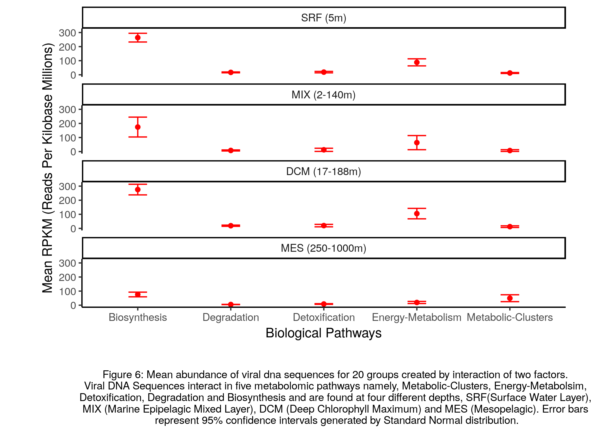

# Summary Report

# Taracyc Ocean Virus Analysis  

```{r, echo=FALSE,out.height=400}

knitr::include_graphics('../img/tara_logo1.png')

```


## Introduction

The ocean is full of mysteries, and plays an important role in oxygen production, weather patterns, climate, carbon sequestration and global ecosystem health. Bacteria help sequester carbon in the ocean and it is estimated that 93% of the earth's carbon dioxide is stored in algae, vegetation, and coral under the sea and cycled through the oceans<sup>1</sup>. There are viruses present can infect bacteria and alter their chance of survival. For example, viruses have been found to use their own viral DNA to turn the photosynthesis system back on in a dying bacterial cell, to promote cell survival<sup>2</sup>. Carbon sequestration is also causing ocean acidification, and is affecting the health of coral reefs<sup>3</sup>.

```{r, echo=FALSE,out.height=400}

knitr::include_graphics('../img/Carbon-Cycle-PIC_med.png')

```

Image Source: [Biological Carbon Pump](http://moocs.southampton.ac.uk/oceans/2014/10/22/emma-cavan-my-research/)

### Motivation for research

To further explore the populations of bacteria and viruses in the oceans, project was led by the TARA oceans <sup>4</sup> collected 300 water samples from all over the world's oceans at various depths. These samples were filtered for viral and bacterial DNA. By understanding these populations and how they might interact, we can gain insight into carbon sequestration patterns and how these viruses are impacting the bacteria. The Hallam lab at UBC created an algorithm to classify these bacterial and viral DNA sequences into categories and specific biological pathways that these sequences may be involved in. We would like to use this data to explore how viral DNA differs across biological pathways and depths to start exploring which areas and pathways are most represented by these creatures.

To learn more about how viruses and bacteria may interact, check out these resources:

- [Viruses and their role in the ocean](https://www.researchgate.net/publication/305447161_Viruses_and_their_role_in_the_ocean_Bacteriophages_and_bacteria_interactions)
- [Marine Viruses: Key Players in Marine Ecosystems](https://www.ncbi.nlm.nih.gov/pmc/articles/PMC5691653/)

## Research Question

Does the mean abundance of viral DNA sequences differ across biological pathways? Does the mean abundance of viral DNA sequences differ across ocean depth levels? Does the mean abundance of viral DNA sequences of the biological pathways differ across ocean depth levels?


## Data Set


We will be analyzing the metaviriome data collected from the [Tara Oceans Project](http://oganm.com/shiny/taracyc/). Downloading data from the R Shiny App is a nine-step manual process. Thus, a data repository [Data_Taracyc_Analysis](https://github.com/HarjyotKaur/Data_Taracyc_Analysis) has been created to store the raw master data. Since the data file is too large, we have used [Github Large File Storage](https://git-lfs.github.com/). For detailed information, of data download visit the [repository](https://github.com/HarjyotKaur/Data_Taracyc_Analysis).


Here are the variables we are using:


| Variable Name | Type | Description |
|---|---|---|
| RKPM | Continuous | Reads per kilobase of transcript per million mapped reads |
| LEVEL1 | Categorical | Biological Pathways |
| Depth | Categorical |  Levels of Ocean depth |


The four depths that we explored are:

- SRF: Surface Water Layer (5m)
- DCM: Deep Chlorophyll Maximum (17-188m)
- MIX: Marine Epipelagic Mixed Layer (2-140m)
- MES: Mesopelagic (250-1000m)


The biological pathways we are analyzing are:

- Biosynthesis:
- Energy-Metabolism
- Degradation
- Detoxification
- Metabolic-Clusters

More information on how interesting and complex these pathways are can be found on [KEGG](https://www.genome.jp/kegg/pathway/map/map01100.html)

### Snapshot of data set


```{r,echo = FALSE}
library(knitr)

cleaned_data_snapshot <- read.csv("../data/taracyc_data_cleaned.csv")

kable(head(cleaned_data_snapshot,5))

```

Table 1: Showcases First few rows of the dataset used for analysis

<br>

```{r,echo = FALSE}
library(knitr)
suppressPackageStartupMessages(library(tidyverse))

cleaned_data <- read.csv("../data/taracyc_data_cleaned.csv")
cleaned_data <- cleaned_data %>% 
  select(RPKM,LEVEL1,DEPTH)
summary <- data.frame(unclass(summary(cleaned_data)), 
                      check.names = FALSE, stringsAsFactors = FALSE)
rownames(summary) <- 1:nrow(summary)

kable(summary)


```

Table 2: Showcases summary statistics of dataset dataset used for analysis

## Exploratory Data Analysis and Data Cleaning


The data consists of 299 samples of ocean organism DNA sequences, to bifurcate samples containing viral and bacterial DNA. Definition for bifurcation available [here](https://github.com/hackseq/tara-cyc-hs18).


```{r, echo=FALSE}


```


Since the research question focuses on viral DNA, we filter out the samples containing only viral DNA sequences. This resulted in 90 samples out of 299, or 30% of the total data.


After, filtering the data we wanted to explore the viral DNA samples collected for various biological pathways across varied ocean depth. *To keep things simple, we are only looking at the higher level biological pathways stored as LEVEL1, but for those who are interested, the original dataset contains LEVEL2 and LEVEL3 variables that further classify the types of biological pathways these genes may be involved in.*


```{r, echo=FALSE}


knitr::include_graphics('../results/figures/fig3_eda_biological_pathways_depth_dna_volume.png')


```


We observe that Viral DNA Sequences samples were collected from four different levels of ocean depth. Also, the samples are able to capture interaction of viral population in five pathways. Majority of samples collected are from Surface Water Layer, the sample capture maximum interaction of Viral DNA in Biosynthesis pathway.


One of the assumptions for a Two-Way ANOVA is homogeneity of variances. We performed Levene's Test to validate the same, it evaluated the p-value <0.05, thus failing the test. Since, we did not have proper tools to tackle the fallout of Levene's Test, we decided to look for outliers in data.


```{r, echo=FALSE}


knitr::include_graphics('../results/figures/fig4_eda_biological_pathways_spread_outliers.png')


```


<br>

<br>


```{r, echo=FALSE}


knitr::include_graphics('../results/figures/fig5_eda_depths_spread_outliers.png')


```


The black dots in Figure 3 and 4 represent outliers in data. RPKM (Reads per kilobase million) values lying below the 0.0 percentile and lying above the 99.99th percentile were removed to ensure the assumption of homogeneity of variances.


After cleaning the data set we observe the mean abundance of viral DNA sequences in groups created for the two factors under consideration, biological pathways and ocean depth. The data gets grouped into 20 categories.


```{r, echo=FALSE}


knitr::include_graphics('../results/figures/fig6_eda_mean_dna_across_categories.png')


```


The mean abundance of viral DNA sequences is highest for biological pathways that occur in surface water layer whereas the mean abundance of viral DNA sequences seems to be similar for Detoxification and Degradation across all depths. To further investigate the interaction between biological pathways and ocean depth levels in terms of mean abundance of viral DNA sequences we will perform a Two-Way ANOVA.


## Analysis


Two-Way ANOVA has certain assumptions:

1. Dependent variable should be measured at the continuous level
2. Two independent variables should each consist of two or more categorical, independent groups.
3. Independence of observations
4. No significant outliers
5. All samples were drawn from normally distributed populations
6. Homogeneity of variances (among the groups should be approximately equal).

#### Factors: Biological Pathways & Ocean Depth

  H<sub>0</sub>: There is no significant interaction between biological pathways and ocean depth levels in terms of mean abundance of viral DNA sequences    

  H<sub>A</sub>: There is a significant interaction between biological pathways and ocean depth levels in terms of mean abundance of viral DNA sequences   


We will be checking the above three set of hypothesis at  5% Level of Significance.


## Results


### Two-Way ANOVA, estimates and F-Statistic


```{r, echo=FALSE}


library(knitr)

results <- read.csv("../results/taracyc_results.csv")

kable(results)

```


Table 3: Showcases results of Two-Way ANOVA, where factors are biological pathways(LEVEL1) and levels of ocean depth (DEPTH), the response variable is abundance of viral DNA (RPKM)

<br>

<br>


Our ANOVA results are shown in the Table 2. All results have a p-value < 0.05, and thus we reject our null hypothesis. There is significant difference in mean abundance of Viral DNA Sequence across biological pathways and levels of ocean depths individually. Also, there is a significant interaction between biological pathways and ocean depth levels in terms of mean abundance of viral DNA sequences. Our findings can be visualized by the plot below.

<br>


```{r, echo=FALSE}



```


It seems that viral DNA that interact in Biological Pathways do not have overlapping confidence intervals across all ocean depth layers. Viral DNA interacting in Degradation, Detoxification and Metabolic-Clusters have overlapping confidence intervals in Deep Chlorophyll Maximum ocean layer.


## Discussion


We can conclude that there is a difference in mean viral DNA across all pathways and depths. However, when comparing interaction effects of each depth and pathway, there are a few groups that may not be significantly different, but it is hard to tell visually. With a Two-Way ANOVA, we are only able to determine whether one or more groups is significantly different than the others. Thus, even though we rejected our null hypothesis, we can not conclude which pathways are significantly different. However, to further investigate these differences, one could do a pairwise t-test or Tukey-Kramer analysis.


## Conclusion


This was a very interesting exploration of viral DNA that represents the world's ocean populations. In the future, we hope to analyze how the viral DNA might affect the abundance of bacterial DNA for each pathway. We hypothesize that the viral DNA will be correlated with the bacterial DNA, as it seems that they interact. <sup>2</sup> Additional factors could be explored, such as how the viral and DNA samples and pathways are distributed across geographical locations. There is so much waiting to be discovered, and we are excited to see what future findings may uncover, and what implications these findings may have on how we manage and care for our oceans in the face of climate change.


## References

- <sup>1</sup> van der Heijden, L. H., and Kamenos, N. A. (2015) Calculating the global
contribution of coralline algae to carbon burial. Biogeosciences
Discussions, 12(10), pp. 7845-7877. [link](http://eprints.gla.ac.uk/106392/1/106392.pdf)

- <sup>2</sup> Thompson et al., (2007) Phage auxiliary metabolic genes and the redirection of cyanobacterial host carbon metabolism. [link](http://www.pnas.org/content/108/39/E757.short)


- <sup>3</sup> Brewer, P.G. (1997) Ocean chemistry of the fossil fuel CO2 signal: the haline signature of "Business as Usual." Geophysical Research Letters 24: 1367-1369.

- <sup>4</sup> [Tara Oceans Project website](https://oceans.taraexpeditions.org/en/m/about-tara/les-expeditions/tara-oceans/)

- [Logo Link](http://oganm.com/shiny/taracyc/)